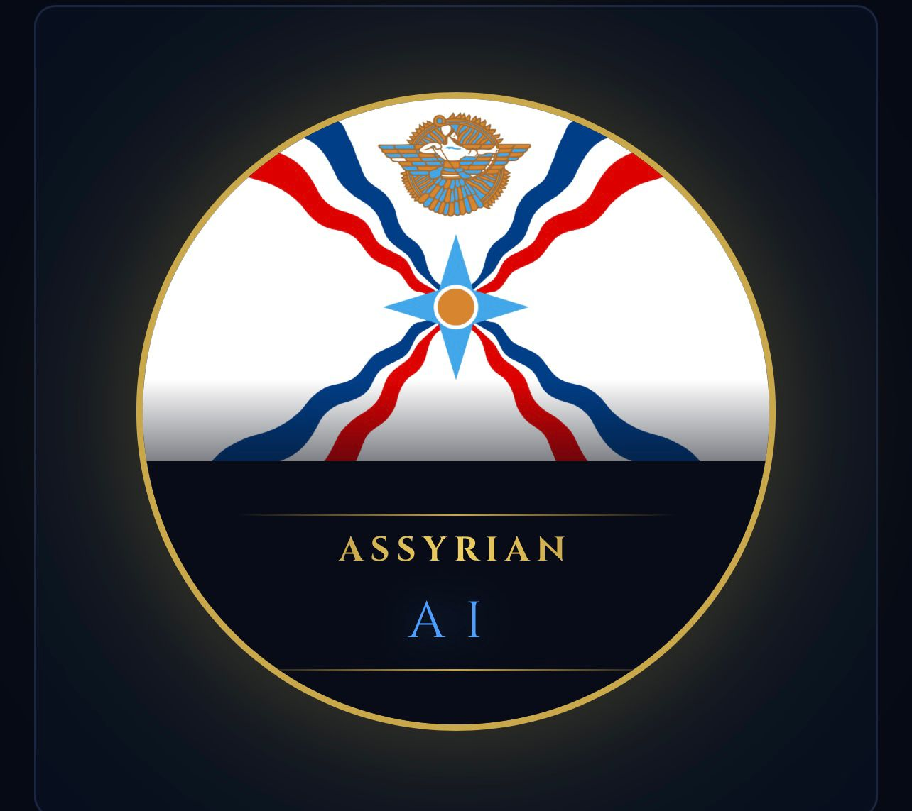

# Assyrian AI Automation — Workflow Mapper

> Discover the top 5 workflows your business runs manually — and what AI can save you.



## What it does

Paste in your business niche (e.g. "dental clinic", "law firm", "e-commerce store") and the app uses AI to generate the **top 5 automation opportunities** tailored to your industry — complete with:

- ⏱ Hours saved per week
- 💰 Estimated monthly cost savings
- 📈 ROI score
- 🔁 n8n trigger & automation steps
- 🤖 Specific AI role in each workflow

## Tech Stack

- **React + Vite** — frontend framework
- **Groq API** (Llama 3.3 70B) — AI workflow generation
- **n8n** — automation platform referenced in workflows

## Getting Started

### 1. Clone the repo
```bash
git clone https://github.com/Assyrian91/assyrian-ai-automation.git
cd assyrian-ai-automation
```

### 2. Install dependencies
```bash
npm install
```

### 3. Add your Groq API key
Create a `.env` file in the root:
```
VITE_GROQ_API_KEY=your_groq_api_key_here
```
Get a free key at [console.groq.com](https://console.groq.com)

### 4. Run locally
```bash
npm run dev
```
Open [http://localhost:5173](http://localhost:5173)

## Deployment

Deployed on **Vercel**. To deploy your own:

1. Push to GitHub
2. Go to [vercel.com/new](https://vercel.com/new)
3. Import the repo
4. Add `VITE_GROQ_API_KEY` as an environment variable
5. Deploy ✅

## Environment Variables

| Variable | Description |
|----------|-------------|
| `VITE_GROQ_API_KEY` | Your Groq API key from console.groq.com |

## License

MIT — built by Assyrian AI